# Architecture

The system as it is. Eighteen amendments were recorded during the build where the implementation
disagreed with the plan; every one that changed the design is folded into the text below rather
than listed as a correction, and [`CHANGELOG-amendments.md`](../CHANGELOG-amendments.md) keeps
the record of what moved and why.

## Five agents, one backbone

| Agent | Identity | What it decides | Graph nodes |
|---|---|---|---|
| Orchestrator | `sa-orchestrator` | Tier, plan, re-tier, dispatch, gates | 7 |
| Questionnaire | `sa-questionnaire` | Generate, send, parse, chase, re-ask | 5 |
| Evidence | `sa-evidence` | Extract, index, retrieve, cross-examine, diff the fourth-party chain | 6 |
| Risk Scorer | `sa-scorer` | Rubric arithmetic and the memo | 2 |
| Watchdog | `sa-watchdog` | Post-approval sweeps and linked re-reviews | 3 |

The last column is the point of [the graph](#the-graph): five services, twenty-three nodes
between them, and the Orchestrator alone is a router, a planner, a barrier and two halves of a
gate.

**ADK 2 builds the agents; Pub/Sub orchestrates them; the graph describes them and nothing
executes it.** Each agent is an ADK `LlmAgent` with its own instruction, tools and output schema,
and nothing composes them into a runnable graph. They never call each other and no process holds
the fleet's position in a review.

The reason is the one the whole design rests on: **any agent can crash without stalling the
fleet.** A graph runner is a place for the review to live, and a place for the review to live is
a process whose death loses it. Here the review's position is a checkpointed row in Firestore
and the next step is an unacknowledged message, so a worker killed mid-send is replaced by
another worker that reads the same two things and carries on. `make demo-crash` is that sentence
executed rather than asserted.

That argument is about **execution**, and for a long time it was also used to avoid writing the
topology down at all. Those are different things, and conflating them cost something real: the
graph still existed — in the shape of five `handle_event` functions, an `EXPECTED_STATES` table
and a transition table — and the three could disagree without anything failing. See
[The graph](#the-graph).

Every arrow between agents is one of twelve Pub/Sub topics, delivered at-least-once and
unordered, with a dead-letter path to `NEEDS_HUMAN` after five attempts. A consumer checks review
state before acting, so a reply arriving after `SCORED` attaches as an addendum and reopens the
score rather than being dropped or applied out of order.

## The graph

Twenty-eight nodes, five bands, three routers, two joins and four cycles, declared in
`shared/graph.py` and **generated** into the diagram above by `scripts/graph_dump.py`. Diagram 23
was absent from this set for most of the build, and the reason given was correct at the time: it
had been specified as a dump of an ADK graph workflow, the Orchestrator is not one, and a
placeholder for a picture the repository cannot produce is worse than a gap. What changed is not
the execution model — there is still no graph runner — but that the topology is now data, so
there is something to dump.

**The graph describes; it never drives.** Nothing in `shared/graph.py` dispatches, schedules or
holds a position. Dispatch is still `shared.subscriber.handlers()`, the review's position is
still a checkpointed row and an unacked message, and `make demo-crash` still works for the same
reason it always did.

What the declaration buys is that it can be **checked**. `make lint` runs
`scripts/check_contracts.py --check graph`, which diffs it against the four places the topology
actually lives:

| It checks | Against |
|---|---|
| every topic a node consumes or emits | `ALL_TOPICS`, and `shared.subscriber.handlers()` |
| the states a node runs in | `EXPECTED_STATES` |
| the state a node advances a review to | the transition table in `shared.domain` |
| a node's reads, writes and denials | `infra/iam/permission-matrix.yaml` |

The last row is the one that earns the module. **It found a real bug on its first run:** the
Watchdog writes the `reviews` collection when it opens a linked re-review, and no row in the
permission matrix granted it — so the generated Firestore rules denied the write, and the
re-review would have failed the first time real IAM was applied while passing every local test
until then. The grant is now in the matrix, scoped and commented, and
`tests/test_iam_boundaries.py` asserts it against the emulator.

### Nodes are not states, and not steps

Three vocabularies that were previously one:

- a **state** is where a review is — nine of them, one per review
- a **node** is a unit of work — twenty-eight of them, several per state
- a **step** is a durable checkpoint — a node may have one, or none

Cross-examination and subprocessor extraction are two nodes inside one state under one
checkpoint. The Orchestrator is one service and one identity, and it is also a router, a planner,
a barrier and two halves of a gate; a diagram that drew it as a single box would be drawing the
deployment rather than the work.

Seven node kinds, and the distinction that matters most is **agent** against **deterministic**:
an agent node reaches a model and its output is judgement, a deterministic node is arithmetic and
its output is reproducible. Scoring and the memo deploy as one service and are two different
kinds, which is exactly why the distinction is on the node rather than on the service.

### Routers, joins and cycles

**Three routers**, each with a direction it may not travel. The tier router may raise scrutiny
and never lower it; the re-tier router may only tighten; a signal is never un-seen. Each of those
is a security property rather than a workflow convenience — a router that could travel the other
way would let a vendor's own answers reduce the scrutiny applied to them — so the constraint is
declared on the router and asserted.

**Two joins**, evaluated by `shared/join.py` against the policy the graph declares. The coverage
join is a threshold at 90% with a named override — an analyst marking the reply thread complete,
which is what happens in the ordinary case of a vendor who answers most of what was asked and
stops. The findings join requires all three arms and parks on a shortfall, because a partial
finding set scored as if complete is the failure this design exists to prevent.

A join returns a **verdict rather than a boolean**. The caller needs to know whether to proceed;
the operator needs to know which arm is short and whether an override exists, and a boolean throws
both away. An arm whose evidence cannot be read is reported `unknown` rather than absent, and an
unknown required arm never satisfies a join — a barrier that opens because its input was
unreadable is worse than one that waits.

**Four cycles, and only one of them needed a budget.** Three terminate by arithmetic: three chase
rounds, one re-ask per answer, and three tiers with a tier that only ever rises. Re-review has no
such bound — every reopening is a legitimate new review by every rule the system has, so a vendor
in a noisy news cycle could be reopened indefinitely, each time costing a questionnaire they have
already answered. The budget is three, counted along the `reopened_from` chain, and what happens
when it is spent is deliberately **not** "stop monitoring": the signal still goes up as a triage
card, and a person decides whether a fourth automated re-review is the right answer.

### Failure edges are executed, not described

Every node declares what happens when it fails: `park`, `degrade` or `skip`, which is the
[failure-semantics rule](#failure-semantics) written per node. The failure edges in the diagram
are **derived** from those policies rather than drawn beside them, so a node whose policy changes
loses its edge in the same commit.

One of them was previously described and not executed. `infra/pubsub.yaml` said a message
reaching its dead-letter topic moves its review to `NEEDS_HUMAN` and surfaces on the dashboard;
`tests/test_late_events.py` asserted it behind a skip; and nothing did it. Pub/Sub moved the
message off the subscription after five deliveries and the *review* sat in whatever state it had,
in flight forever, with no card. `shared/subscriber.py` now reads `delivery_attempt` and parks on
the last delivery — before the dead-letter, because a consumer that has already lost the message
cannot act on it.

### Replay

`make replay REVIEW=<id>` reconstructs any review's path through the graph, and the dashboard
renders the same projection at `/review/<id>/graph` with every node expandable to its contract.

The projection reads the review document, the event ledger, the reasoning records, the cards and
the findings — **no new collection and no new IAM row**, all of it what the audit binder already
reads. That constraint was chosen before the code was written and it shaped the design: a
projection with its own write path would be a second source of truth about what happened, and the
first thing a second source of truth does is disagree with the first one.

It also means the projection is retroactive. A review that ran before this module existed
projects exactly as well as one that ran after it, because nothing was instrumented for it. One
optional field was added to an existing write path — `record_decision(..., node=)` — which makes
the answer exact where a node has no checkpoint, publishes no event and writes no collection of
its own; without it, dossier recall on a repeat review would show as never having run.

A node whose evidence cannot be read reports `unknown`, never `pending`. The two look identical
on a diagram and mean opposite things, and a projection that collapsed them would be least
reliable at exactly the moment somebody was using it to diagnose a failure.

## Who may move a review

The Orchestrator owns the plan and **every forward transition**. Any component may *stop* a
review — into `GATED` or `NEEDS_HUMAN` — through `shared.state.park`, which validates the
transition, writes the ledger event and raises the dashboard card.

The asymmetry is deliberate. The cost ceiling, the screening boundary and the contact gate all
need to stop a review from where they are, and routing a park through the Orchestrator would
mean a lost message leaves a review claiming to be in flight after it has already stopped —
a worse inconsistency than the one it would fix. **Anything can stop a review; only the
Orchestrator can advance one**, and `tests/test_state_ownership.py` asserts it.

A reopened review is a new linked record with `reopened_from` set. History is never mutated.

## Four memory layers

| Layer | Lifetime | Answers |
|---|---|---|
| L1 · session state | the turn | what am I doing right now? |
| L2 · Firestore ledger | forever, immutable | what happened, exactly? |
| L2.5 · retrieval index | the review | which passage says this? |
| L3 · durable vendor memory | across reviews and years | what is worth knowing next time? |

### Chunking, and what its heading rule does and does not catch

A chunk breaks on paragraph boundaries, is capped at `CHUNK_TOKENS`, and **a heading never ends
a chunk** — a section title is the most searchable line in its section and it travels with the
text it names.

That rule used to recognise Markdown headings only, which meant it did nothing at all on a
typeset PDF and did nothing without ever failing. It now also matches Roman-numeral sections,
appendix and annex titles, and short all-caps lines: four matches in 256 paragraphs on a real
63-page audit report, all four genuine headings, and no change to any fixture.

**One pattern was tried and dropped, and the limitation is real.** Numbered sections — the
obvious way to catch `3.1 Access control` — matched 33 paragraphs in that document and not one
was a heading. All 33 were numbered *footnotes*, which is what the bottom of a typeset page is
full of. A footnote marker and a section number are the same string in the same position, and
separating them needs page geometry that text extraction has already discarded. So a document
that numbers its sections gets the old behaviour, and `SECTION 3 ACCESS CONTROL` is missed too,
because all-caps matching excludes digits to keep a cover date from reading as a title.

The rule is tuned for precision rather than recall on purpose: it only ever *moves* a paragraph
forward, so a false positive tears a real paragraph off its chunk while a false negative changes
nothing.

**Chunking and embedding belong to the Evidence agent, not to screening.** Chunking calls
`routing.embed`, embedding is a generative model call, and the screening identity is declared
*never: any generative model call*. Leaving the call in the promotion path would have made the
published permission matrix false, silently, and detectably only once real IAM was applied. The
ordering constraint the design cares about survives: only clean-bucket content is ever chunked,
and a reference outside it is refused.

Embeddings are `gemini-embedding-001` at **3072 dimensions**, measured against the live API. The
dimension is fixed at index creation, so a wrong guess means dropping and rebuilding.

### What durable memory is allowed to hold

Enumerated note types, a controlled vocabulary, a provenance tag of `human`, `rule` or
`model_structured`, and a twelve-word ceiling on any string. **Never free text derived from
vendor content**, and never the review transcript — dumping that into L3 turns it into a slower,
dumber L2.

The guard is not stylistic. L3 is recalled into a planning prompt *at the start of the next
review, before any screening has run in it*, which makes it the one place content from an
earlier review could reach a model without passing a detector in this one.

When something worth carrying does not fit, the answer is a new note type rather than a looser
rule. The conditions attached to a conditional approval are the worked example: they are
sentences a person typed, thirteen words and up, so they live on the approval record in the
ledger and the dossier holds an `approval_condition` note pointing at the review that has them.

## Nothing reaches a model except through one function

`shared.routing.generate` is the only path to a model in the system, and there is deliberately
**no default model**: a task with no routing entry raises rather than falling back, because a
silent fallback makes the cost figure untrue.

That is also why **policy P2 is enforced there** rather than at the tool gateway. The gateway is
for effects on the world and a model call is not one; routing prompts through it to reach the
policy would blur a boundary that is currently clean. Since nothing reaches a model except
through `generate`, the router is the only place *"no external content reaches a model without a
verified stamp"* can be made true — and before it was moved, that sentence was in the
architecture document, in the diagrams and in the narration, and enforced nowhere.

`generate` verifies **one stamp per named source**, so a prompt built from an inadmissible
document is refused even when another document on the same review screened clean.

Two models. `gemini-3.5-flash` for parsing, extraction and classification; `gemini-3.7-flash`
for exactly two jobs, cross-examination and the risk memo. Temperature is 0 everywhere.

## Exactly-once effects

Every side effect is claimed before it happens, under `review_id:plan_vN:step_id`. Four outcomes
and they are not symmetrical:

- **Claim, effect, record** — the normal path. A replay returns the recorded result.
- **Claim released** — the effect provably did not happen (`effect_attempted = False`), and the
  key is free for a genuine retry.
- **Claim open, effect unknown** — the worker died between the two. The replay **refuses**. A
  claim that cannot be verified is not a claim that may be repeated.
- **Confirmed by a person** — `idempotency.confirm` closes an open claim on a named human's word
  that the effect happened, promoting the claim payload to the result.

There is deliberately **no "it did not happen, run it again"** path out of the third case.
Releasing a claim for an effect that might have occurred is the operation that sends the second
email, and that refusal is the honest answer to *why might a resumable agent order two laptops*.

A re-plan rekeys outbound steps (`REKEYED_ON_REPLAN`) so questions added by a re-tier can be
sent while questions already asked cannot be asked twice.

## Scoring

Trust Score, 0–100, higher is safer. Each domain starts at its weight and loses 2, 5 or 10
points per finding by severity. Pure Python, and `agents/risk_scorer/scoring.py` cannot reach
`shared.routing` in its transitive imports — asserted, because an import graph is the only form
of *no model call happens here* that cannot quietly stop being true.

**No contradiction multiplier.** The severity anchors already define *high* as a control the
vendor claims is in place being contradicted by their own evidence, so a contradiction was
priced the moment the severity was assigned. Multiplying again charges the same fact twice.
*No fact is priced twice* survives questioning in a way *we set it to 1.5* does not. The
contradiction flag stays on the finding and drives the binder, the badge and the finding text;
it is not a score lever.

**Scored over the domains the plan asked about**, renormalised to 100 — not over the tier's
nominal profile. The Tier 1 profile includes AI-specific controls, and scoring a freight company
on them awarded it ten out of ten in a domain nobody put a question to.

**Adversarial Conduct** takes 25 points after the domain arithmetic and regardless of it, and
forces the band to escalate.

### What a provenance label claims

Every finding carries `rule` or `model`. A finding that turns on a date carries a second label
for the date, because the first was quietly claiming more than it proved:

| | |
|---|---|
| `date extracted` | a model read it off the page |
| `date declared` | a person or an internal system stated it |
| `date computed` | this system derived it from other dates |

`rule` describes the conclusion. On an expired certificate the conclusion is a comparison the
code performed and the input is a date a model read out of a PDF. Both labels print side by side
in binder section 4.

## The fourth-party chain

The only place an agent queries an internal system rather than reading a document. The model
extracts five fields per subprocessor; a set difference and a date comparison against
`approved_vendors` decide what they mean, so every finding is `source=rule`.

`approved_vendors` has readers and no writer in all ten identities, deliberately: an agent that
could add a name could make an unknown fourth party known by writing one document.

The restraint is the design. Every finding gates on `processes_customer_data`; the agreement and
residency findings are one per vendor rather than one per company, because the control that
failed is flow-down and it fails once however many companies it fails for; and
`processes_customer_data` and `dpa_claimed` are three-valued, so silence is not a no.

## The second review

A review that ran before makes the next one shorter without making it laxer.

**What carries:** the outcome and the tier it ended at, the band and score, the conditions the
approver attached, the certificate expiry, the contact, a usability rating for every answer, and
the adversarial conduct flag.

**What changes:** the tier starts where the last review ended and never falls, so a second
intake form more modest than the first buys nothing. And a question is re-asked unless three
things hold — its answer was rated usable, its text is unchanged, **and the prior review recorded
no finding in its domain**.

The third gate is what makes it a saving rather than a shortcut. The first two alone carried
fifty of DataDynamo's fifty-four questions, which is a rubber stamp. The finding is the reason
the review happened, and asking around it would be the worst possible economy. A vendor carrying
a conduct flag carries nothing at all.

## The audit binder

Eight sections, HTML with a print stylesheet, rendered in about fifty milliseconds. **Rendered
by a template, never by a model**, and the cover says so — asserted by an import graph, because
a document that could be steered by the content it reports on is worse than no document.

## The operator console

Eleven screens over the ledger, built to the design canvas in `Drawbridge.html`. Server
components reading Firestore directly; one client component, and only because the sidebar needs
the URL.

**No write path anywhere in it.** No API route, no mutation, no signing key — asserted against
the source tree by `tests/test_console.py` rather than left as a convention. The console is where
an operator decides, and it holds nothing that can act on the decision, which is the same
argument `shared/gateway.py` makes by refusing to sign.

Two things reach the screen through generated JSON rather than being declared twice, because the
console is TypeScript and the fleet is Python: the review graph (`scripts/graph_dump.py`) and the
policy — rubric, permission matrix, the three gateway policies (`scripts/policy_dump.py`).
`make console` rewrites both and a test regenerates and diffs, so a stale copy fails CI rather
than showing last week's rubric.

Three screens are arguments rather than views. **Agent Registry** is derived from the node
contracts, so it cannot print a permission the matrix does not grant. **Evidence** makes the same
four-way screening distinction `shared.armor` makes — including *not a verdict* for a stub or a
seeded fixture — rather than a softer one. **Settings** shows the policy and cannot change it,
because policy lives in version control and a change to the rubric is a diff somebody reviewed.

The console and the audit binder share one palette; the diagrams keep the older slate one. Those
are documentation *about* the system rather than output *from* it.

## Data model

Twenty-three collections, every one of them named in the permission matrix and enforced at
collection level by generated Firestore rules. See [Security](security.md).

## Failure semantics

The rule that decides all of it: **mandatory controls fail closed, optional controls degrade,
and never the other way round.** Model Armor unavailable promotes nothing and parks the review.
A skipped detector is not a detector that found nothing. A retrieval index that is unavailable
falls back to whole-document reconciliation with the prompt saying so. A feed outage logs and
skips, and the Watchdog never blocks or degrades an active review.

Every node in [the graph](#the-graph) declares which of the three it does, and the diagram's
failure edges are derived from those declarations rather than drawn next to them. Dead-letter
exhaustion is now one of them rather than a sentence in `infra/pubsub.yaml` that nothing
executed.
