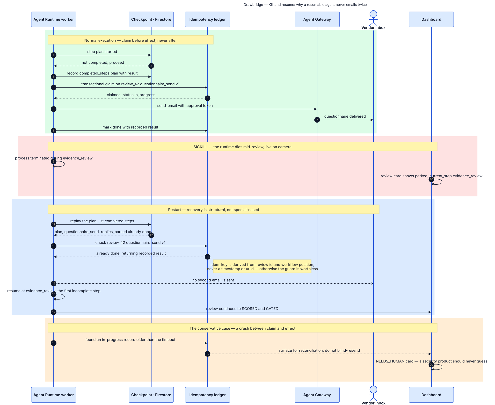

# Architecture

The system as it is. Sixteen amendments were recorded during the build where the implementation
disagreed with the plan; every one that changed the design is folded into the text below rather
than listed as a correction, and [`CHANGELOG-amendments.md`](../CHANGELOG-amendments.md) keeps
the record of what moved and why.

## Five agents, one backbone

| Agent | Identity | What it decides |
|---|---|---|
| Orchestrator | `sa-orchestrator` | Tier, plan, re-tier, dispatch, gates |
| Questionnaire | `sa-questionnaire` | Generate, send, parse, chase, re-ask |
| Evidence | `sa-evidence` | Extract, index, retrieve, cross-examine, diff the fourth-party chain |
| Risk Scorer | `sa-scorer` | Rubric arithmetic and the memo |
| Watchdog | `sa-watchdog` | Post-approval sweeps and linked re-reviews |

**ADK 2 builds the agents; Pub/Sub orchestrates them.** The planning documents describe a graph
workflow, and that is not what this is. Each agent is an ADK `LlmAgent` with its own instruction,
tools and output schema — that part is as designed — but nothing composes them into a graph.
They never call each other and no process holds the fleet's position in a review.

The reason is the one the whole design rests on: **any agent can crash without stalling the
fleet.** A graph runner is a place for the review to live, and a place for the review to live is
a process whose death loses it. Here the review's position is a checkpointed row in Firestore
and the next step is an unacknowledged message, so a worker killed mid-send is replaced by
another worker that reads the same two things and carries on. `make demo-crash` is that sentence
executed rather than asserted. It is also why there is no `scripts/graph_dump.py` and no diagram
23: there is no graph to dump, and a picture the repository cannot produce is not one to fake.

Every arrow between agents is one of twelve Pub/Sub topics, delivered at-least-once and
unordered, with a dead-letter path to `NEEDS_HUMAN` after five attempts. A consumer checks review
state before acting, so a reply arriving after `SCORED` attaches as an addendum and reopens the
score rather than being dropped or applied out of order.

## Who may move a review

The Orchestrator owns the plan and **every forward transition**. Any component may *stop* a
review — into `GATED` or `NEEDS_HUMAN` — through `shared.state.park`, which validates the
transition, writes the ledger event and raises the dashboard card.

The asymmetry is deliberate. The cost ceiling, the screening boundary and the contact gate all
need to stop a review from where they are, and routing a park through the Orchestrator would
mean a lost message leaves a review claiming to be in flight after it has already stopped —
a worse inconsistency than the one it would fix. **Anything can stop a review; only the
Orchestrator can advance one**, and `tests/test_state_ownership.py` asserts it.

A reopened review is a new linked record with `reopened_from` set. History is never mutated.

## Four memory layers

| Layer | Lifetime | Answers |
|---|---|---|
| L1 · session state | the turn | what am I doing right now? |
| L2 · Firestore ledger | forever, immutable | what happened, exactly? |
| L2.5 · retrieval index | the review | which passage says this? |
| L3 · durable vendor memory | across reviews and years | what is worth knowing next time? |

**Chunking and embedding belong to the Evidence agent, not to screening.** Chunking calls
`routing.embed`, embedding is a generative model call, and the screening identity is declared
*never: any generative model call*. Leaving the call in the promotion path would have made the
published permission matrix false, silently, and detectably only once real IAM was applied. The
ordering constraint the design cares about survives: only clean-bucket content is ever chunked,
and a reference outside it is refused.

Embeddings are `gemini-embedding-001` at **3072 dimensions**, measured against the live API. The
dimension is fixed at index creation, so a wrong guess means dropping and rebuilding.

### What durable memory is allowed to hold

Enumerated note types, a controlled vocabulary, a provenance tag of `human`, `rule` or
`model_structured`, and a twelve-word ceiling on any string. **Never free text derived from
vendor content**, and never the review transcript — dumping that into L3 turns it into a slower,
dumber L2.

The guard is not stylistic. L3 is recalled into a planning prompt *at the start of the next
review, before any screening has run in it*, which makes it the one place content from an
earlier review could reach a model without passing a detector in this one.

When something worth carrying does not fit, the answer is a new note type rather than a looser
rule. The conditions attached to a conditional approval are the worked example: they are
sentences a person typed, thirteen words and up, so they live on the approval record in the
ledger and the dossier holds an `approval_condition` note pointing at the review that has them.

## Nothing reaches a model except through one function

`shared.routing.generate` is the only path to a model in the system, and there is deliberately
**no default model**: a task with no routing entry raises rather than falling back, because a
silent fallback makes the cost figure untrue.

That is also why **policy P2 is enforced there** rather than at the tool gateway. The gateway is
for effects on the world and a model call is not one; routing prompts through it to reach the
policy would blur a boundary that is currently clean. Since nothing reaches a model except
through `generate`, the router is the only place *"no external content reaches a model without a
verified stamp"* can be made true — and before it was moved, that sentence was in the
architecture document, in the diagrams and in the narration, and enforced nowhere.

`generate` verifies **one stamp per named source**, so a prompt built from an inadmissible
document is refused even when another document on the same review screened clean.

Two models. `gemini-3.5-flash` for parsing, extraction and classification; `gemini-3.7-flash`
for exactly two jobs, cross-examination and the risk memo. Temperature is 0 everywhere.

## Exactly-once effects

Every side effect is claimed before it happens, under `review_id:plan_vN:step_id`. Four outcomes
and they are not symmetrical:

- **Claim, effect, record** — the normal path. A replay returns the recorded result.
- **Claim released** — the effect provably did not happen (`effect_attempted = False`), and the
  key is free for a genuine retry.
- **Claim open, effect unknown** — the worker died between the two. The replay **refuses**. A
  claim that cannot be verified is not a claim that may be repeated.
- **Confirmed by a person** — `idempotency.confirm` closes an open claim on a named human's word
  that the effect happened, promoting the claim payload to the result.

There is deliberately **no "it did not happen, run it again"** path out of the third case.
Releasing a claim for an effect that might have occurred is the operation that sends the second
email, and that refusal is the honest answer to *why might a resumable agent order two laptops*.

A re-plan rekeys outbound steps (`REKEYED_ON_REPLAN`) so questions added by a re-tier can be
sent while questions already asked cannot be asked twice.

## Scoring

Trust Score, 0–100, higher is safer. Each domain starts at its weight and loses 2, 5 or 10
points per finding by severity. Pure Python, and `agents/risk_scorer/scoring.py` cannot reach
`shared.routing` in its transitive imports — asserted, because an import graph is the only form
of *no model call happens here* that cannot quietly stop being true.

**No contradiction multiplier.** The severity anchors already define *high* as a control the
vendor claims is in place being contradicted by their own evidence, so a contradiction was
priced the moment the severity was assigned. Multiplying again charges the same fact twice.
*No fact is priced twice* survives questioning in a way *we set it to 1.5* does not. The
contradiction flag stays on the finding and drives the binder, the badge and the finding text;
it is not a score lever.

**Scored over the domains the plan asked about**, renormalised to 100 — not over the tier's
nominal profile. The Tier 1 profile includes AI-specific controls, and scoring a freight company
on them awarded it ten out of ten in a domain nobody put a question to.

**Adversarial Conduct** takes 25 points after the domain arithmetic and regardless of it, and
forces the band to escalate.

### What a provenance label claims

Every finding carries `rule` or `model`. A finding that turns on a date carries a second label
for the date, because the first was quietly claiming more than it proved:

| | |
|---|---|
| `date extracted` | a model read it off the page |
| `date declared` | a person or an internal system stated it |
| `date computed` | this system derived it from other dates |

`rule` describes the conclusion. On an expired certificate the conclusion is a comparison the
code performed and the input is a date a model read out of a PDF. Both labels print side by side
in binder section 4.

## The fourth-party chain

The only place an agent queries an internal system rather than reading a document. The model
extracts five fields per subprocessor; a set difference and a date comparison against
`approved_vendors` decide what they mean, so every finding is `source=rule`.

`approved_vendors` has readers and no writer in all ten identities, deliberately: an agent that
could add a name could make an unknown fourth party known by writing one document.

The restraint is the design. Every finding gates on `processes_customer_data`; the agreement and
residency findings are one per vendor rather than one per company, because the control that
failed is flow-down and it fails once however many companies it fails for; and
`processes_customer_data` and `dpa_claimed` are three-valued, so silence is not a no.

## The second review

A review that ran before makes the next one shorter without making it laxer.

**What carries:** the outcome and the tier it ended at, the band and score, the conditions the
approver attached, the certificate expiry, the contact, a usability rating for every answer, and
the adversarial conduct flag.

**What changes:** the tier starts where the last review ended and never falls, so a second
intake form more modest than the first buys nothing. And a question is re-asked unless three
things hold — its answer was rated usable, its text is unchanged, **and the prior review recorded
no finding in its domain**.

The third gate is what makes it a saving rather than a shortcut. The first two alone carried
fifty of DataDynamo's fifty-four questions, which is a rubber stamp. The finding is the reason
the review happened, and asking around it would be the worst possible economy. A vendor carrying
a conduct flag carries nothing at all.

## The audit binder

Eight sections, HTML with a print stylesheet, rendered in about fifty milliseconds. **Rendered
by a template, never by a model**, and the cover says so — asserted by an import graph, because
a document that could be steered by the content it reports on is worse than no document.

## Data model

Twenty-three collections, every one of them named in the permission matrix and enforced at
collection level by generated Firestore rules. See [Security](security.md).

## Failure semantics

The rule that decides all of it: **mandatory controls fail closed, optional controls degrade,
and never the other way round.** Model Armor unavailable promotes nothing and parks the review.
A skipped detector is not a detector that found nothing. A retrieval index that is unavailable
falls back to whole-document reconciliation with the prompt saying so. A feed outage logs and
skips, and the Watchdog never blocks or degrades an active review.
