# Live demo

Four beats and an optional fifth. Each one is a command, each one is asserted rather than narrated, and each one fails
loudly if it does not happen.

## 1 · The whole review

```bash
make reset
make demo-fixtures VENDOR=datadynamo
```

Seventeen beats, in order:

```
intake                      Tier 2, with the intake answer that decided it named in the ledger
plan_ready                  the plan checkpointed before anything is sent
contact_gate_parked         P1 refuses the send — no human has approved first contact
contact_gate_released       a named person issues a scoped, single-use token
questionnaire_sent          one email, claimed under review:plan_v1:questionnaire_send:v1
retier                      the vendor's own answer reveals a broader scope → Tier 1
additional_questions_sent   the new domain's questions go out; nothing is asked twice
replies_parsed              incrementally, as batches arrive
vague_answers_re_asked      four answers below the confidence threshold are re-asked, quoted back
evidence_screened           four documents into the clean bucket with verdict-bearing stamps
findings_ready              seven findings, each labelled rule or model
fourth_party_gap            a company receiving customer data that nobody here has reviewed
scored                      64, conditional, with the per-domain arithmetic
decision_gate_parked        G1 — no DECIDED state without a named human
decided                     approved with two conditions attached
binder_rendered             eight sections, ~50ms, template-rendered
monitoring_swept            the Watchdog opens a linked re-review on the expired certificate
```

**The one to watch is `retier`.** It fires mid-correspondence, while replies are still arriving,
because a re-tier after the thread closed would be a report about the review rather than a
correction to it. The vendor said something their own intake form had not, the review got harder,
and the questions already asked were not asked again.

**And `fourth_party_gap`**, which is the newest and the one no incumbent surfaces:

```
Sendline Notifications receives customer data through DataDynamo Logistics in EU (Dublin)
— Delivery notification email and SMS — and this organisation has never reviewed it.
It is not on the approved-vendor register.
```

## 2 · Kill it mid-send

```bash
make demo-crash
```

Three real processes. The first is driven to the instant the questionnaire has left the building
and sent SIGKILL — uncatchable, so no handler runs and nothing tidies up. The kill lands in the
narrowest window there is: **after the email was sent and before its idempotency claim closed**,
which from the outside is indistinguishable from a worker that died a millisecond earlier and
sent nothing.

The second worker replays the send and **refuses** it. A claim it cannot verify is not a claim it
may repeat.

A named person then confirms the email did go out. The third worker replays it again, logs
`idempotency SKIP`, banks the checkpoint and finishes the whole review.

```
the crash added no message and lost no work; the review finished in 17 beats
```

The vendor receives one questionnaire per plan version and none from the crash. There is
deliberately no "it did not happen, run it again" — releasing a claim for an effect that might
have occurred is the operation that sends the second email.

## 3 · The second review

```bash
make demo-second
```

Runs DataDynamo end to end, closes it with a named person attaching two conditions, then opens a
second review six months later on the demo clock:

```
  1 · first review demo-datadynamo-... closed
        outcome         conditional at Tier 1, score 64
        conditions      2 attached by the approver
        dossier notes   59 written

  2 · six months later, the second review opens holding
        prior review ... · conditional at Tier 1 · band conditional · 2 condition(s) attached ·
        certificate expiring 2025-03-14 · 50 question(s) answered well · 5 domain(s) with findings

  3 · second review second-datadynamo-... planned
        tier            1   (first review ended at 1)
        questions       43 asked, 11 carried
```

Two things changed because of it. **Scrutiny never falls** — the tier starts where the last
review ended, so a second intake form more modest than the first buys nothing. And **43 questions
instead of 54**: the eleven carried are the only domain that came back clean, because a domain
that produced a finding is asked again in full.

## 4 · The calibration

Three synthetic vendors, three bands, none on a boundary:

| Vendor | Score | Band | Margin |
|---|---|---|---|
| CleanCloud | 91 | approve (≥80) | 11 above |
| DataDynamo | 64 | conditional (60–79) | 4 above |
| NimbusWrite | 38 | escalate (<60) | 21 below |

`tests/test_calibration.py` asserts the bands **and** that each score sits at least four points
inside its band at every boundary, so a later change to a finding set fails a test rather than
silently reclassifying a vendor.

NimbusWrite is the story in one number. Its arithmetic alone reaches **63 — conditional**. It
escalates because the Adversarial Conduct modifier takes 25 points and forces the band: the
arithmetic said conditional, and the vendor telling us who they are outvoted it.

## What each beat proves



| Beat | Claim |
|---|---|
| `contact_gate_parked` | An agent cannot email anyone until a person says so |
| `retier` | The review corrects itself on the vendor's own evidence, mid-flight |
| `vague_answers_re_asked` | It interrogates rather than collects |
| `fourth_party_gap` | It queries an internal system, not just the vendor's documents |
| `scored` | The model judged severity; the code computed the number |
| `decided` | No decision without a named human |
| the crash | One effect, however many times the event is redelivered |
| the second review | Memory makes the next review shorter without making it laxer |

## The fifth beat, if there is time

```
make replay REVIEW=<the id the first beat printed>
```

The review just run, projected onto [the review graph](architecture.md#the-graph): twenty-eight
declared nodes, which of them ran, in what order, with what evidence behind each status. The same
projection renders at `/reviews/<id>/graph` in the console, with every node expandable to its
contract.

It is worth ninety seconds for one reason. Every other beat shows the system *working*; this one
shows that the picture of the system and the system are the same object. Nothing here was
instrumented for the replay — it reads what the audit binder reads — so it works on a review
recorded before the projection existed.

## Recording notes

`demo-fixtures` is deterministic and free, so it can be rehearsed as many times as needed and
produces the same beats every run. `make demo` runs the same script against the live models and
needs quota — the free tier caps the fast model at 20 requests a day and a full review makes
about thirty, so the live run is a billing question rather than a code question.

Replay either: same Trust Score, same findings, same re-tier, idempotent skips logged.
