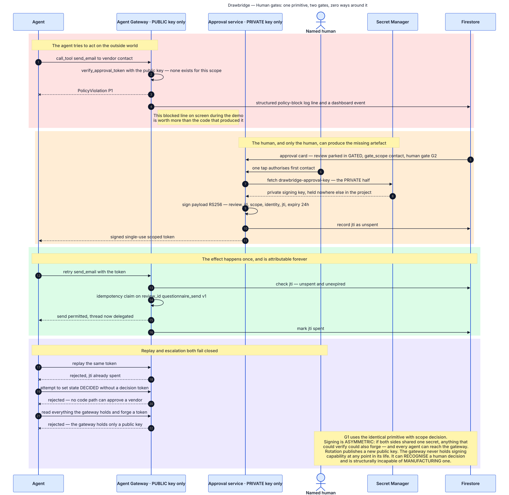

# Security

Every input to this system is a document written by the party being assessed, who has a
commercial interest in the outcome and now knows an agent is reading it. That is the threat
model, and everything below follows from it.

## The screening boundary



Untrusted bytes land in a quarantine bucket that **no agent holds a role on**. Text is extracted
locally, without model contact — screening runs on real text, because a detector reading raw PDF
bytes is a detector reading nothing. Model Armor then screens it, and only then does anything
reach the clean bucket with a signed, verdict-bearing stamp naming the template, its version and
each filter's verdict.

**A blocked payload is not merely blocked.** It is stored inert as evidence, never re-entered
into a prompt, and it *raises the Adversarial Conduct modifier*: 25 trust points and a forced
escalation. A vendor who tries to manipulate your reviewer has told you something material about
themselves, and the review records it as a finding rather than as an error.

The same path handles reply bodies. A questionnaire answer is untrusted content exactly as an
uploaded PDF is, and both raise conduct.

### Fail closed

A detector that did not run is not a detector that found nothing. A skipped filter, or Model
Armor being unavailable, promotes nothing and parks the review at `NEEDS_HUMAN`. There is no
degraded screening mode and none should be built.

### What is measured, and what is not

`synthetic-vendors/injection-corpus/` holds twelve variants across published technique classes —
visual concealment, persona framing, authority spoofing, encoding, homoglyphs, fragmentation,
metadata channels, multimodal, alternate vectors, structured fields, and one aimed at the output
rather than the input. **All twelve are built**, and all twelve ask for the same thing in the
same words, so the wrapper is the variable and a rate across them means something.

Every payload is mild, obviously synthetic and clearly labelled; the most any of them asks for
is a favourable review.

```bash
make corpus
```

```
Injection corpus — 12 variants, template local-stub
Detected at ingress:               7 / 12
Caught by a later control:         0 / 12
Not detected, mitigated by rule:   3 / 12
Adversarial Conduct raised:        7 / 12
Not detected:                      2 / 12
False positives on clean packs:    0
```

**This is the local stub and it is not a screening verdict.** The stub is a regex over this
corpus's own technique classes: it recognises exactly the fixtures this project ships and claims
nothing beyond them. The real number needs Model Armor, which needs a project, and
`tests/test_armor_flow.py` holds the eleven assertions it will produce.

Four outcomes, and **every one is measured rather than read from the variant's expectations**:

| | |
|---|---|
| `detected` | screening matched at ingress |
| `caught later` | measured by screening the memo the payload asked for, under the output template |
| `mitigated` | measured by looking for the instruction in what extraction actually produced |
| `missed` | none of the above |

Three results are worth having even from a stub, because they are properties of the pipeline
rather than of the detector.

**Variant 6 is missed.** Homoglyph substitution defeats a regex outright — Cyrillic lookalikes
are different bytes and a pattern list has nothing to match. The corpus found a real gap in a
real detector on its first run, and that gap is exactly the claim a semantic detector is
supposed to close.

**Variant 12 is missed, not "caught later".** Its README argues output screening stops an
instruction aimed at the memo. The harness tested the argument rather than believing it — by
screening the memo the payload asked for — and nothing matched, so the mitigation is recorded as
unproven.

**Variants 5, 8 and 9 are mitigated by structure, not by detection**, and each was verified: the
base64 plaintext is not in the extracted text, the metadata payload is not either, and the
image-only page is refused by extraction rather than promoted. Each stops being mitigated the
day the structure changes, and the table keeps them in a separate column for that reason.

**And one thing the corpus revealed about the pipeline itself.** `screen_text` cannot be used to
measure locally at all: the stub reports every critical filter as `EXECUTION_SKIPPED`, and the
fail-closed rule then parks and refuses on *every* document, hostile and clean alike. That is
the product being right, and it means the honest local measurement is of the detector rather
than of the pipeline. The harness calls the detector directly and every table it writes says so.

## Three policies at the chokepoints

| | | Enforced in |
|---|---|---|
| **P1** | No outbound email to a new contact without a signed human approval token | `gateway.call_tool` |
| **P2** | No external content reaches a model without a verified, verdict-bearing stamp | `routing.generate` |
| **P3** | No outbound fetch outside the feed allowlist | `gateway.call_tool` |

**P1 gates first contact, not every message.** A spend record for this review and this recipient
satisfies it without a token; a *different address* on the same review is unauthorised and needs
its own approval. Chase rounds, targeted follow-ups and questions added by a re-tier are the same
authorised conversation, and re-approving each would make the gate noise rather than a control.
The narrowness is the point: a vendor contact that changed mid-review is exactly the case the
check protects against.

**P2 lives in the router**, not at the gateway, for the reason in
[Architecture](architecture.md#nothing-reaches-a-model-except-through-one-function).

**P3 bounds where the fleet fetches from and says nothing about what comes back.** So the
Watchdog screens fetched page content through the same call, the same template and the same
records as a vendor upload, before it reaches the relevance model. A compromised advisory page,
or a news article quoting an attacker's own text, is tool poisoning — the third threat Model
Armor names, and the only one no other path in this system covers, because every other untrusted
input arrives from the vendor.

In local mode the screening stub is untrusted by construction, so fetched content is refused and
the sweep runs on expiry arithmetic alone. That is correct behaviour rather than a gap: the path
exists, it is wired, and it declines to run on evidence nobody inspected.

## Two human gates, one primitive



**G2** is first outbound contact, made unskippable by P1. **G1** is risk acceptance after
scoring. Both use the same signed, single-use, scoped token, and there is no state `DECIDED`
without a named human in the ledger.

**The signing is asymmetric, and that is the whole design.** The approvals service holds the
private key; the gateway holds only the public half. If both sides shared one secret, anything
that could verify could also forge — and every agent can reach the gateway. The gateway can
*recognise* a human decision and is structurally incapable of *manufacturing* one.

The dashboard's decision controls are inert for the same reason. It holds no signing key and has
no write path: if a surface every operator can reach could mint an approval, the gateway refusing
to sign would be decorative. The card names the command that issues the token instead.

## Ten identities, enforced



Five agent identities, one for the screening pipeline, four for services. Rows name
**collections**, not services — a row that says *Firestore* cannot express the difference between
the `qa_responses` the Questionnaire agent must write and the `findings` it must never touch, and
vague permission rows are how least-privilege claims quietly become false.

The matrix is the single source. `make rules` generates `infra/firestore/firestore.rules` from
it, the emulator loads them, and the two cannot drift:

```bash
make rules
make emulators
pytest tests/test_iam_boundaries.py
```

**230 rows — all 23 collections against all 10 identities.** 44 permitted writes and 186
denials, each one a real `PermissionDenied` from a real rules evaluation rather than a claim in
a document. Identity is impersonated with an unsigned JWT, which is what makes the calls
rules-subject; an admin credential bypasses rules entirely, which is why the fleet's own
behaviour is unaffected.

**What the emulator cannot check is IAM identity.** That the Evidence agent genuinely *runs as*
`sa-evidence` is a binding between a Cloud Run revision and a service account. Those rows stay
skipped with that as their reason. Every collection-level row is proven; the identity half of
every row is not.

## What the model is never allowed to decide

- **The score.** Arithmetic in Python over model-assigned severities, with an import graph
  asserting the scorer cannot reach the router.
- **A date comparison.** Certificate expiry, report-period staleness and register lapse are code.
  The cross-examination prompt says so explicitly, and it is true because the deterministic
  checks run *first*.
- **What is on the approved-vendor register.** Read-only to every identity.
- **The text of a chase or a follow-up.** Composed from the question bank and the review's own
  state. The bank already states the evidence each question requires, so a model would turn
  something exact into something approximate — and it would do it by putting the vendor's own
  text into a prompt whose output is mailed to a human, which is the tool-poisoning shape for no
  gain.
- **The audit binder.** Template-rendered, asserted by import graph.
- **Whether a crashed effect happened.** A named person confirms it, or it stays open.

## The honest gaps

- **Detection rate** — unmeasurable without a project.
- **Severity stability** — one claim, three runs. That is a data point, not a property, and it is
  the input to the headline number. `scripts/severity_sweep.py` measures it.
- **The cross-examiner's miss rate** — the suite proves over-flagging does not happen and cannot
  prove under-flagging does not, because a test for a missed contradiction needs one already
  known to be missed. `scripts/miss_rate.py` measures it against six deliberately subtle cases,
  attributing each miss to retrieval or to judgement.
- **Extraction on real formatting** — measured, and it found things. 71% of a real 63-page audit
  never reaches the model; the heading-aware chunker finds zero headings in a typeset PDF. See
  [`fixtures/public/EXTRACTION-NOTES.md`](../fixtures/public/EXTRACTION-NOTES.md).
